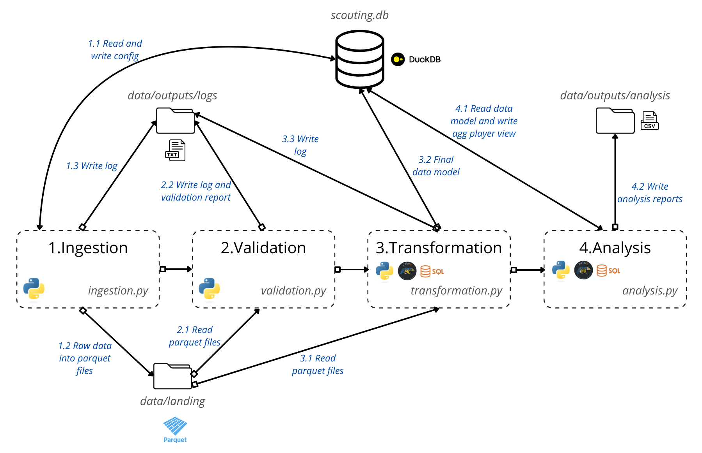
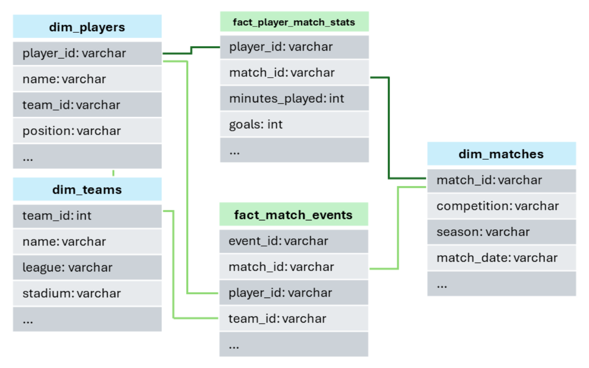

# Oscar Bartolome - Gemini Technical Assessment

Complete ELT and Analysis project for football scouting data. Ingests raw CSV/JSON, validates, transforms with Polars, stores in DuckDB and produces analytical reports using Polars or SQL.

## Folder Directory

-   src/

    -   ingestion.py: ingest raw files (CSV/JSON) into Parquet landing.
    -   validation.py: schema and business-rule validation using Pydantic.
    -   transformation.py: data cleaning, normalization and save to DuckDB.
    -   analysis.py: aggregated views and reporting.
    -   db_utils.py: SQL helpers and table creation queries.

-   data/

    -   raw/ — original source files.
    -   landing/ — Parquet files written by ingestion.
    -   processed/scouting.duckdb — DuckDB database with final tables and configuration.

-   outputs/

    -   logs/ — ingestion / validation / transformation logs and reports (.TXT)
    -   analysis/ — generated analysis outputs (.CSV).

-   tests/ — unit tests for ingestion, validation and transformation steps using PyTest.

-   README.md

-   requirements.txt

## Part 1: Ingestion & Data Integrity

Before reaching the final analysis, the raw data passes through a complete pipeline that looks like this:

{fig-align="center"}

1.  Ingestion (*src/ingestion.py*):

    1.  It accesses the db config table (*elt_config*) to check when the last ingestion was performed. It will only extract files added since that date.

    2.  Converts the files to Parquet format to unify formats and improve readability and transformation speed. Stored in *data/landing*.

    3.  A TXT log is then written (*output/log/ingestion*) containing all execution traces.

    4.  The last ingestion date is updated.

2.  Validation using Pydantic (*src/validation.py*):

    1.  Parquet files are loaded and the data undergoes a validation process using the Pydantic package:

        -   Checks correct data types.
        -   Searches for duplicate and orphaned rows.
        -   Describes position tags.
        -   Checks and counts Null values.
        -   Checks xG (negative values and values exceeding shot totals) and other business logic constraints.

    2.  A comprehensive TXT report is then written detailing all errors and warnings.

    3.  Additionally, a TXT log is written (*output/log/validation*) containing all execution traces.

3.  Transformation (*src/transformation.py*):

    1.  Parquet files are loaded and the data is cleaned using the Polars package:

        1.  Eliminates duplicate and orphaned rows.

        2.  Normalizes position labels and dates.

        3.  Incorrect xG values are converted to Null.

    2.  Creation of new metrics like *Goal Contribution* and *G-xG*.

    3.  Once the data is cleaned and transformed, the final model is created using DuckDB. It looks like this:

        {width="695"}

Notes:

-   The first time the data is transformed, the tables are created and populated. On subsequent runs, new data will be upserted into the existing tables. The SQL queries for table creation can be found in *src/db_utils.py*. The database instance is located in the *data/processed* folder.

-   I have implemented several unit tests for these steps using the PyTest package, which can be found in the *tests/* folder.

## Part 2: Analytics & Scouting Logic

In this part, an aggregated view of player stats will be created. Then, player scouting and team reports will be generated using a search engine and analytical queries based on this view.

1.  Analysis (*src/analysis.py*):

    1.  First, an aggregated view of player stats is built containing:

        1.  Season metric aggregates.

        2.  Per 90 adjusted metrics.

    2.  Then, a custom function to filter players based on different features or metrics is developed. This will be used to create three different player profile searches:

        1.  Effective scorers: Players with at least 5 goals and a goals minus xG difference of at least 2 units.

        2.  Defensive midfielders: Players in midfield positions with pass accuracy of at least 75%, at least 3 interceptions per 90, and a duel win rate of at least 50%.

        3.  Creative attackers: Players with at least 2 key passes per 90 and a goal contribution per 90 of at least 0.5.

        These reports will be stored as CSV files in: *outputs/analysis*.

    3.  Finally, a summary report is generated for a specific team or all teams:

        1.  All season metrics (including average pass accuracy).

        2.  Top three players by goal contributions (Goals + Assists).

    Notes: The functions for this step offer the option to perform all analysis queries using either Polars or SQL. This provides an opportunity to compare both approaches in terms of advantages and performance.

## Part 3: Production Deployment Strategy

### Local Development to Production Timeline:

-   The first step is to create a Docker container containing the entire pipeline to ensure environment reproducibility (Python version, package dependencies, etc.).

-   Ideally, three different environments would be established:

    -   Development: Where development and new feature creation begin, potentially using less expensive technologies (DBs, machines, etc.).

    -   Staging: An environment identical to Production for verifying that changes or new features developed in Development work as expected in a Production-like setting.

    -   Production: Where the final implementations run.

### CI/CD Pipeline

-   I would implement a CI/CD pipeline using GitHub Actions to automate testing and deployment.

<!-- -->

-   Each developer will create their own branch from the Development environment for every new change or feature they are working on.

    -   Before pushing changes to Development, pull the latest changes to your branch to avoid future conflicts.

    -   To push completed work, a pull request must be approved by at least one reviewer.

        -   Every time a Pull Request is created against the main or develop branch, the CI pipeline would automatically trigger the execution of integration and unit tests, as well as a code formatter review.

-   Once several changes (or a critical one) or a new feature is ready for testing in Staging:

    -   Test the overall platform functionality.

    -   Check integration and performance tests.

-   When confident that everything works correctly, proceed to Production.

-   Additionally, tools like Terraform can be used to reproduce and deploy infrastructure, avoiding manual creation errors.

### Orchestration

-   Apache Airflow would be used to manage workflows as DAGs. A main DAG would be created to execute:

    1.  Scheduled trigger, for example daily.

    2.  Ingestion: Run the ingestion module that reads data from sources (APIs, Amazon S3 buckets, etc.).

    3.  Validation: Run the validation script on raw data to generate the report.

    4.  Clean and Transform: Run the transformation script for cleaning and business logic transformations.

    5.  Store the data: Insert transformed data into the final database.

    6.  Reporting: Generate final views, provide access via web apps or dashboards, and generate reports to an Amazon S3 bucket for the scouting team.

    Task dependencies and automatic retries in case of failures will be managed with Airflow.

## 4. Final Considerations

### Future Improvements

There are some features that could not be implemented due to time constraints that I would like you to consider:

-   Developing a better strategy for handling business logic errors such as incorrect xG values.

-   Adding more tests.

-   Creating a web application using Shiny or Streamlit for data visualization and exploration.

-   Considering a Data Lakehouse approach instead of a Data Warehouse. This could significantly reduce costs for data storage and access.